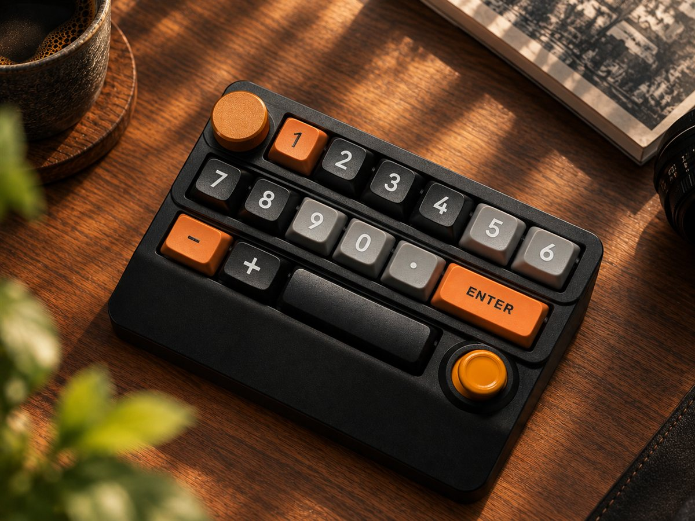
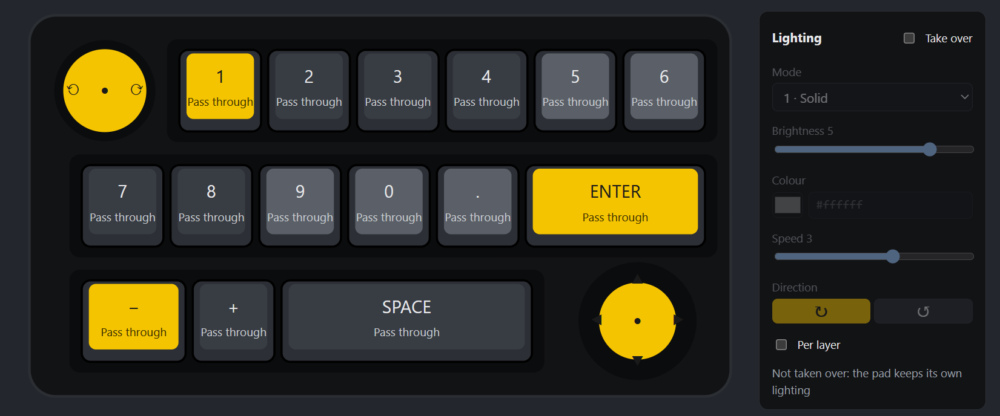

# MacroHub

English | [中文](README.zh-CN.md)

**A system layer for macro pads · Windows 11 + an Unreal Engine plugin** — MacroHub turns every physical key, knob and
joystick on a macro pad into a configurable "function", switches behaviour with the application in front, and hands
controls to applications (such as the Unreal Engine editor) over a local protocol so they can act on their own context.
No firmware flashing required.

<p align="center">
  
  &nbsp;
  
</p>
<p align="center"><sub>Left: the SXS-W909 pad (knob, 15 keys, joystick) · Right: the MacroHub setup page, where each control shows its function in the current layer</sub></p>

---

## Features

- **Recognises the pad without touching your main keyboard**: reads the pad's vendor HID channel as each key's "physical identity" and correlates it with the keyboard hook, so only the pad's own keystrokes are intercepted (no leaks in testing; see [Architecture](docs/architecture.md)).
- **Layers and functions**: control → layer → function → action. Actions are shortcuts, text, macros, programs, mouse input or layer switches; unbound keys inherit, pass through or are blocked.
- **Per-application behaviour**: switch layers and override actions by foreground process; "hold in sync" for games.
- **Input shaping**: knob detents per trigger, minimum interval; auto-repeat for keys and the joystick; shared or per layer.
- **Backlight**: mode, brightness, colour, speed and direction, per layer or per Unreal editor context.
- **Connection and battery**: USB cable and 2.4G receiver; the status bar and the tray icon show the connection and battery level.
- **App client protocol v2**: named pipe `\\.\pipe\MacroHub` (recommended) or WebSocket; applications receive raw control events (with sequence numbers and timestamps) and report their own context, with automatic fallback to local shortcuts when they are offline.
- **Unreal Engine plugin**: per editor context (Level Editor / Sequencer / Animation Editor / Animation Blueprint / PIE), runs editor shortcuts, commands, console commands and frame-accurate timeline scrubbing; a visual binding panel, a status bar entry and per-context backlight.
- **Web setup page**: `http://127.0.0.1:17900/` with a visual key editor, key learning, a searchable function library, live events, an interception test bench and built-in help.
- **English and Chinese**: the web UI, help, tray, Unreal plugin and documentation are available in both languages.

## Supported hardware

| Device | Status |
|---|---|
| SXS-W909 (firmware "YXT K100 Kbd"), USB cable (PID `4100`) | ✅ Tested; default configuration included |
| Its 2.4G receiver (PID `4101`) | ✅ Tested: keys, knob, lighting, battery |
| Its Bluetooth mode | ⚠️ Not verified |
| Other macro pads | Match the device under "Device & interception" and "Learn" each key's signatures; works best with a vendor bitmap channel |

## Installation

**Requirements**: Windows 11 x64 (developed and tested there). Windows 10 and ARM64 should work but are not verified.
Release packages are self-contained; no .NET install needed.

1. Download `MacroHub-<version>-win-x64.zip` from [Releases](../../releases) and extract it (verify with the `.sha256` file if you like).
2. In the extracted folder run:
   ```powershell
   powershell -ExecutionPolicy Bypass -File .\install.ps1 -AutoStart
   ```
   This installs to `%LOCALAPPDATA%\Programs\MacroHub` (current user, no administrator rights), adds a Start menu shortcut, starts it at sign-in and opens the setup page.
3. Or skip installing and run `MacroHub.exe --open` from the extracted folder (portable mode).

More options (elevated start-up, uninstalling, data locations, troubleshooting) are in [Installation](docs/installation.md).
To install the Unreal plugin, see the [Unreal plugin guide](docs/ue-plugin.md).

## Usage

Open <http://127.0.0.1:17900/>. **Help** at the top right is the complete user guide (source:
[`help.en.md`](src/MacroHub/wwwroot/help.en.md) / [`help.zh-CN.md`](src/MacroHub/wwwroot/help.zh-CN.md)).

The default configuration has five layers: Stock keypad (pass-through), Office, UE Editor (used automatically while
`UnrealEditor.exe` is in front), Game and an interception test layer.

## Architecture

```
 Macro pad (stock firmware, cable or 2.4G)
   ├─ keyboard collection (keypad codes, owned by Windows) ──► WH_KEYBOARD_LL hook ◄── timing correlation ──┐
   ├─ vendor collection FF00 (physical key bitmap)  ──────────► HID reader (physical identity) ────────────┤
   ├─ consumer collection (knob volume)             ──────────►                                           │
   └─ vendor feature channel FF01 ◄── backlight writes / battery query                                     ▼
                                                   routing: layer → function → application profile → input shaping
                                                          │                 │                          │
                                                 local actions (SendInput)  named pipe / WS         web UI / tray
                                                                    (the Unreal plugin and other apps)
```

Design decisions and measurements are in [docs/architecture.md](docs/architecture.md); the app client protocol in
[docs/protocol.md](docs/protocol.md); the device protocol in [docs/device-protocol.md](docs/device-protocol.md).

## Building from source

Requires the [.NET 10 SDK](https://dotnet.microsoft.com/download); the end-to-end tests also need Node.js 22+; the
Unreal plugin needs Unreal Engine 5.8.

```powershell
dotnet build MacroHub.slnx -c Release
dotnet test MacroHub.slnx -c Release
.\scripts\run.ps1            # build, start and open the setup page
.\scripts\publish.ps1        # release package in artifacts\MacroHub-<version>-win-x64.zip
```

The repository layout, tests (including end-to-end), diagnostic tools, plugin localization and the release process are
described in [docs/development.md](docs/development.md). Contributions are welcome; please read
[CONTRIBUTING.md](CONTRIBUTING.md) first.

## Roadmap

- [x] Phase 1: Windows system layer (device recognition and interception, layered functions, application profiles, input shaping, web setup and testing, app client protocol v2, installation)
- [x] Phase 2: Unreal Engine plugin (pipe client, editor context detection, editor actions, Sequencer and animation timelines, visual binding panel, status bar, backlight)
- [x] 2.4G receiver, battery display, tray icon, English and Chinese
- [ ] Bluetooth verification; Enhanced Input injection for PIE / packaged games; more device presets

## Security

MacroHub installs a global keyboard hook and serves an unauthenticated web UI on `127.0.0.1`; it only accepts requests
from its own page and from local non-browser clients. See [SECURITY.md](SECURITY.md) for the security model and how to
report vulnerabilities.

## License

[MIT](LICENSE)

## Disclaimer

This project is not affiliated with the keyboard's manufacturer. Product names and models are mentioned only to
describe compatibility and belong to their respective owners.
